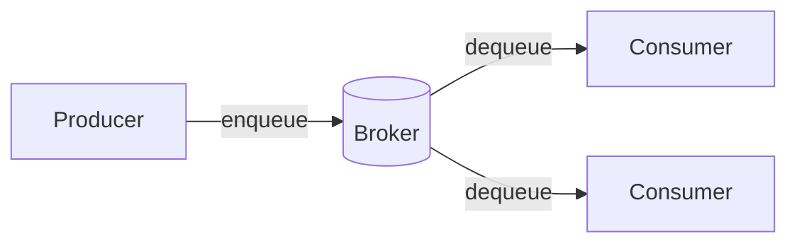
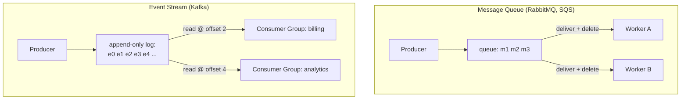
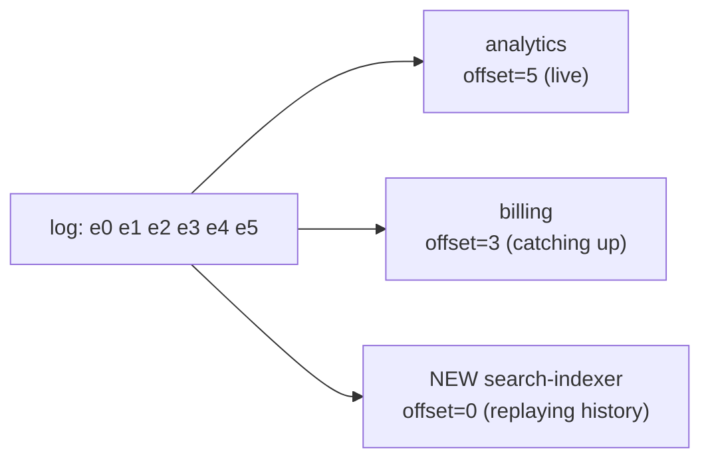

Asynchronous messaging is how you **decouple** producers from consumers: the producer drops work
and moves on, a broker holds it, and consumers process at their own pace. This absorbs spikes,
smooths load, and lets services fail independently. Two building blocks dominate — the **message
queue** and the **event stream** — and interviewers love to probe whether you know the difference.

## 1. Why put a broker in the middle?



- **Decoupling** — the producer doesn't know or wait for the consumer.
- **Buffering / load-leveling** — a traffic spike fills the queue instead of crushing the DB.
- **Resilience** — if a consumer is down, messages wait instead of being lost.
- **Fan-out** — one event can drive many independent consumers.

:::tip
The classic tell that you need a queue: work that is **slow, spiky, or can be done later** — sending
email, encoding video, generating thumbnails, updating search indexes. Do it off the request path.
:::

## 2. Queue vs stream — the core distinction

A **message queue** is a to-do list: each message is delivered to *one* worker, and once
acknowledged it is **deleted**. A **log-based stream** (Kafka) is an append-only journal:
messages are **retained**, and each consumer group tracks its own **offset** — so many consumers
can read the same events, and anyone can rewind.



The mental model: a queue **pushes and forgets**; a stream **stores and lets you replay**.

## 3. Side by side

| | Message Queue | Event Stream (Kafka) |
|--|--|--|
| **Data model** | Transient messages | Durable, ordered, append-only log |
| **After consumption** | Deleted on ack | **Retained** (time/size-based) |
| **Consumers** | Compete — one gets each message | Independent groups, each with its own offset |
| **Replay history** | No — it's gone | **Yes** — reset the offset and re-read |
| **Ordering** | Best-effort / per-queue | Strong ordering **within a partition** |
| **Throughput** | High | Very high (partitioned, sequential disk I/O) |
| **Typical use** | Task/job distribution, RPC-style work | Event sourcing, analytics, multi-consumer fan-out |
| **Examples** | RabbitMQ, SQS, ActiveMQ | Kafka, Pulsar, Kinesis |

:::senior
Kafka scales throughput by splitting a topic into **partitions**; ordering is guaranteed only
*within* a partition, and consumers in a group each own some partitions. So the **partition key**
(e.g. `user_id`) is a real design decision: it sets both your ordering boundary and your parallelism.
:::

## 4. Retention and replay — the stream superpower

Because a stream **keeps** events, it enables patterns a queue cannot:

- **Replay** — a new analytics service reads from offset 0 and reconstructs all history.
- **Reprocessing** — you ship a bug fix, reset the consumer offset, and re-run the corrected logic
  over past events.
- **Multiple independent consumers** — billing, search-indexing, and analytics each read the *same*
  events at their *own* pace, none blocking the others.
- **Event sourcing** — the log itself is the source of truth; current state is a fold over the events.



:::gotcha
Retention is bounded — Kafka keeps data for a configured time or size (e.g. 7 days), then **deletes
or compacts** old segments. "Infinite replay" is only true within the retention window (or if you
tier storage). Don't assume the log is forever.
:::

## 5. Delivery guarantees (know these three)

- **At-most-once** — fire and forget; may drop messages. Fine for metrics.
- **At-least-once** — retried until acked; may **duplicate**. The common default → make consumers
  **idempotent**.
- **Exactly-once** — no loss, no dupes. Expensive and narrow (Kafka offers it in-ecosystem); usually
  achieved in practice as *at-least-once + idempotency*.

:::key
Interviewers want to hear: most real systems are **at-least-once**, so design consumers to be
**idempotent** (processing the same message twice is safe). Chasing true exactly-once is a common
over-engineering trap.
:::

## Check yourself

```quiz
title: Queues and streaming check
questions:
  - q: 'A new analytics service must process the last 30 days of order events to backfill a dashboard. Which building block supports this directly?'
    options:
      - 'A message queue — re-enqueue every old message'
      - text: 'An event stream (Kafka) — reset the offset and replay retained events'
        correct: true
      - 'Neither; you must query the primary database'
    explain: 'Streams retain events and track per-consumer offsets, so a new consumer can start at offset 0 and replay history. A queue deletes messages on ack, so there is nothing to replay.'
  - q: 'In a plain message queue with three competing workers, a given message is delivered to…'
    options:
      - text: 'Exactly one worker, then deleted on acknowledgment'
        correct: true
      - 'All three workers, each keeping its own copy'
      - 'A random worker, but kept forever for replay'
    explain: 'Queue workers compete: one worker receives each message and, once acked, it is removed. Independent fan-out to multiple consumers is the stream model, not the queue model.'
  - q: 'What does Kafka guarantee about message ordering?'
    options:
      - 'Total ordering across the entire topic'
      - text: 'Ordering only within a single partition'
        correct: true
      - 'No ordering guarantees at all'
    explain: 'Kafka orders messages within a partition, not across the whole topic. That is why the partition key (e.g. user_id) matters — it defines both the ordering boundary and the unit of parallelism.'
  - q: 'Your consumers run with at-least-once delivery. What is the key design implication?'
    options:
      - 'Messages may be lost, so add a database backup'
      - text: 'Messages may be delivered more than once, so make consumers idempotent'
        correct: true
      - 'Nothing — at-least-once means no duplicates'
    explain: 'At-least-once means retries can cause duplicates. Making consumers idempotent (processing the same message twice has the same effect as once) is the standard, pragmatic answer over chasing true exactly-once.'
```

:::key
A **queue** distributes tasks — one consumer per message, deleted on ack, no replay (RabbitMQ, SQS).
A **stream/log** (Kafka) **retains** ordered events so many consumer groups read at their own
**offset** and can **replay** history — enabling analytics, reprocessing, and event sourcing.
Ordering holds **per partition**; assume **at-least-once** delivery and build **idempotent** consumers.
:::
