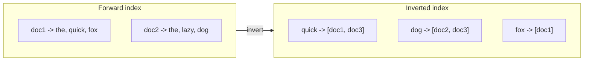
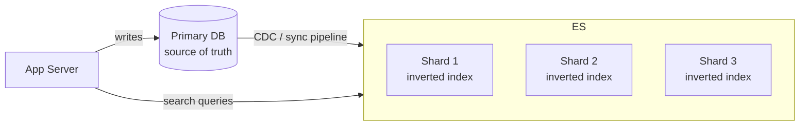
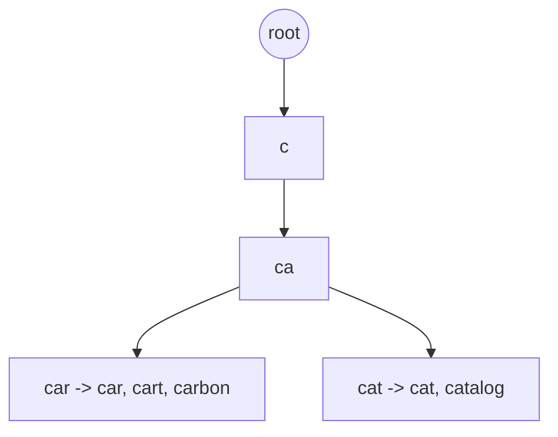

"Add search" sounds simple until you realize a `LIKE '%term%'` query scans every row and cannot
rank results. Real search flips the problem with an **inverted index** — the same data structure
behind Elasticsearch, Lucene, and every search engine. Understanding it is the difference between
"we'll just query the DB" and a design that actually scales.

## 1. Why not just use the database?

```sql
SELECT * FROM docs WHERE body LIKE '%dog%';
```

This does a **full table scan** on every search — O(n) over all documents, no index usable, and no
notion of *relevance* (which result is best?). At any real scale this collapses. We need a
structure that maps **a word → the documents containing it**, precomputed. That is the inverted
index.

## 2. Forward index vs inverted index

A normal (forward) index maps `document → its words`. Search needs the opposite: `word → documents`.



Each word points to a **posting list** — the set of documents that contain it. To search for a
term you jump straight to its posting list; no scanning.

## 3. Building an inverted index, step by step

Watch it form from three tiny documents. Each word is lowercased and tokenized, then appended to
that word's posting list.

```walkthrough
title: Build an inverted index from 3 documents
code: |
  doc1: "the quick fox"
  doc2: "the lazy dog"
  doc3: "quick brown dog"
steps:
  - text: 'Tokenize doc1 → [the, quick, fox]. Add each word, pointing to doc1. Index: the→[1], quick→[1], fox→[1].'
    line: 1
  - text: 'Tokenize doc2 → [the, lazy, dog]. "the" already exists, so append doc2 to its list. Index: the→[1,2], quick→[1], fox→[1], lazy→[2], dog→[2].'
    line: 2
  - text: 'Tokenize doc3 → [quick, brown, dog]. Append to existing lists for "quick" and "dog". Index: the→[1,2], quick→[1,3], fox→[1], lazy→[2], dog→[2,3], brown→[3].'
    line: 3
  - text: 'Query "quick dog" → intersect posting lists: quick→[1,3] AND dog→[2,3] = [3]. Only doc3 matches both — found in two lookups, no scanning.'
    line: 3
```

The magic is the last step: a multi-word query becomes an **intersection of posting lists**, which
is fast because the lists are sorted. Ranking (TF-IDF / BM25) then orders the matches by relevance.

:::senior
Two ideas make this production-grade. **Analysis**: before indexing, text is lowercased, split on
punctuation, **stemmed** ("running" → "run"), and stripped of **stop words** ("the", "a") — so
"Running" matches "run". **Relevance scoring** (BM25): rarer terms count more, and a term appearing
often in a short document ranks higher. Search returns *ranked* results, not just matches.
:::

## 4. Where Elasticsearch fits

Elasticsearch (built on Lucene) wraps the inverted index with the operational machinery you'd
otherwise build yourself: distribution, replication, and a query API.



- The DB stays the **source of truth**; Elasticsearch is a **derived read model** kept in sync.
- The index is **sharded** across nodes for scale and **replicated** for availability.
- Queries fan out to shards and merge ranked results.

:::gotcha
Elasticsearch is **not** your primary database. It is a search index fed *from* your DB (often via
change-data-capture). It favors availability and near-real-time indexing over strong consistency —
a just-written record may take a moment to become searchable. Never treat it as your system of record.
:::

## 5. Autocomplete / typeahead

Typeahead has a brutal constraint: it fires on **every keystroke** and must return in tens of
milliseconds, so a full search query per key is too slow. It gets its own structure — a **prefix
tree (trie)** or an **edge-n-gram** index — usually held in memory.



- A **trie** stores words by shared prefix; typing `ca` walks to that node and returns the top
  completions cached there.
- Completions are **precomputed and ranked** by popularity, so each keystroke is a fast prefix
  lookup, not a search.
- Serve it from an in-memory store (Redis / a dedicated service) and **debounce** keystrokes to
  cut request volume.

:::tip
Distinguish the two clearly in an interview: **full-text search** = inverted index + relevance
ranking (Elasticsearch); **autocomplete** = prefix lookup over a trie/n-grams, optimized for
per-keystroke latency. They are different problems with different structures.
:::

## Check yourself

```quiz
title: Search check
questions:
  - q: 'What does an inverted index map?'
    options:
      - 'Each document to the list of words it contains'
      - text: 'Each word (term) to the list of documents that contain it'
        correct: true
      - 'Each user to their search history'
    explain: 'An inverted index maps term → posting list of documents. That is what lets a search jump straight to matching docs instead of scanning every row.'
  - q: 'How is a multi-word query like "quick dog" answered against an inverted index?'
    options:
      - text: 'Intersect the posting lists of "quick" and "dog"'
        correct: true
      - 'Scan every document for both words'
      - 'Union the posting lists and return everything'
    explain: 'Each term has a sorted posting list; ANDing a query intersects those lists to find docs containing all terms. No document scan is needed.'
  - q: 'What is the correct role of Elasticsearch relative to your primary database?'
    options:
      - 'It replaces the database as the system of record'
      - text: 'It is a derived, sharded search index kept in sync from the DB (the source of truth)'
        correct: true
      - 'It is a cache for the most recent writes only'
    explain: 'Elasticsearch is a derived read model fed from the DB, favoring availability and near-real-time indexing. The database remains the source of truth; a just-written record may be briefly unsearchable.'
  - q: 'Why is a trie (prefix tree) preferred for autocomplete instead of a full search query per keystroke?'
    options:
      - 'Tries store more data'
      - text: 'A prefix lookup is fast enough to run on every keystroke within tens of milliseconds'
        correct: true
      - 'Full-text search cannot match prefixes at all'
    explain: 'Typeahead fires per keystroke under a tight latency budget. Walking a trie to a prefix node and returning precomputed, popularity-ranked completions is far cheaper than a relevance-scored search each key.'
```

:::key
Full-text search relies on the **inverted index**: term → posting list, so queries jump to matches
and multi-word queries **intersect** lists, then rank by relevance (BM25). **Elasticsearch** wraps
this with sharding/replication and is a **derived index synced from the DB**, never the source of
truth. **Autocomplete** is a separate problem — a **trie/n-gram** prefix lookup tuned for
per-keystroke latency.
:::
