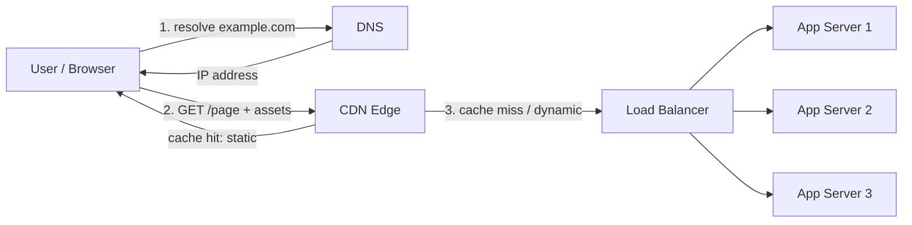
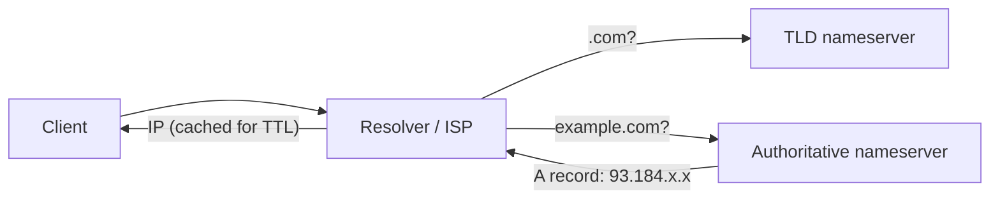
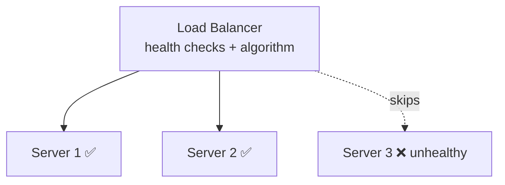

Before a request ever reaches your application code, it passes through three building blocks that
appear in **every** internet-scale design: **DNS** turns a name into an address, a **CDN** serves
content from close to the user, and a **load balancer** spreads traffic across your servers. They
are so ubiquitous that interviewers expect you to place them from memory and explain what each buys you.

## 1. The request's first three hops



Read it left to right: **name → address (DNS)**, then **content from the edge (CDN)**, then
**balanced across servers (LB)**. Each layer's job is to answer the request as early as possible so
the layer behind it does less work.

## 2. DNS — the internet's phone book

DNS resolves a human name (`example.com`) into an IP address, walking a hierarchy and caching
aggressively via TTLs.



- Results are **cached** at every level for the record's **TTL** — low TTL = agility, high TTL =
  fewer lookups.
- DNS is also a coarse **routing tool**: **GeoDNS** returns the nearest region's IP, and returning
  multiple IPs gives basic round-robin distribution.
- Health-aware DNS supports **failover** — stop handing out the IP of a dead data center.

:::tip
DNS is the *first* place you can do load distribution and geo-routing — before any of your servers
are involved. But its TTL-based caching makes it **slow to react**: a changed record can take
minutes to propagate, so DNS is for coarse routing, not fine-grained balancing.
:::

## 3. CDN — content close to the user

A CDN is a globally distributed cache of **edge servers**. It stores copies of your content near
users, so a request in Tokyo is served from Tokyo, not your origin in Virginia.

- **What it serves**: static assets (images, JS, CSS, video) and cacheable dynamic responses.
- **Why it wins**: shorter physical distance = lower latency, and edge hits **never touch your
  origin**, slashing origin load and bandwidth cost.
- **How it fills**: on a cache miss the edge fetches from the origin once, caches it for a TTL, and
  serves everyone else locally (pull model); or you push content proactively.

:::senior
A CDN also absorbs traffic spikes and provides a **security perimeter** — DDoS mitigation, TLS
termination, and WAF rules run at the edge before traffic reaches you. For read-heavy static
content, a CDN is often the single highest-leverage scaling move: it can serve the vast majority of
bytes without your infrastructure ever seeing them.
:::

## 4. Load balancer — spreading the real work

Once a request reaches your origin, the load balancer distributes it across a pool of identical
servers, health-checks them, and hides individual server failures.

| Dimension | Options | Notes |
|--|--|--|
| **Layer** | L4 (transport/TCP) vs L7 (application/HTTP) | L4 is fast and dumb; L7 can route by path/header/cookie |
| **Algorithm** | Round-robin, least-connections, IP-hash | Least-connections adapts to uneven request cost |
| **Health checks** | Active probes | Stops routing to unhealthy instances |
| **Sessions** | Stateless (best) vs sticky sessions | Prefer stateless servers so any node can serve any request |



:::gotcha
The load balancer must not become a single point of failure. Run it **redundantly** (active-passive
or active-active) so a dead balancer doesn't take the whole system down. And prefer **stateless**
app servers — sticky sessions pin users to one box and break clean failover and scaling.
:::

## 5. How they combine (and how they differ)

| Building block | Turns… into… | Primary win | Reacts |
|--|--|--|--|
| **DNS** | name → IP | Coarse geo-routing, first hop | Slowly (TTL) |
| **CDN** | request → cached edge copy | Latency + offloads origin for static/cacheable content | Fast, at the edge |
| **Load Balancer** | request → one healthy server | Even load, failover across servers | Instantly |

They stack: **DNS** points the user at the nearest **CDN** edge; the CDN serves what it can and
forwards misses to a **load balancer**, which picks a healthy app server. Same three boxes, nearly
every design.

## Check yourself

```quiz
title: CDN / DNS / LB check
questions:
  - q: 'A user in Tokyo loads your site hosted in Virginia and images appear almost instantly. What most likely served them?'
    options:
      - 'The origin server over a fast link'
      - text: 'A CDN edge server in or near Tokyo'
        correct: true
      - 'The DNS resolver'
    explain: 'CDNs cache content on edge servers near users. A Tokyo edge serves the images locally, avoiding a round trip to the Virginia origin and cutting latency dramatically.'
  - q: 'Why is DNS a poor tool for fine-grained, fast-reacting load balancing?'
    options:
      - 'It cannot return more than one IP'
      - text: 'Its results are cached by TTL at many levels, so changes propagate slowly'
        correct: true
      - 'It only works for static content'
    explain: 'DNS caching (TTL) means a changed record takes time to propagate. It is great for coarse geo-routing and failover but cannot rebalance traffic instantly the way a load balancer can.'
  - q: 'What is the advantage of an L7 (application-layer) load balancer over an L4 one?'
    options:
      - 'It is always faster'
      - text: 'It can route based on request content like URL path, headers, or cookies'
        correct: true
      - 'It requires no health checks'
    explain: 'L7 balancers understand HTTP, so they can route by path/header/cookie (e.g. /api to one pool, /images to another). L4 is faster but only sees TCP, so it cannot make content-based decisions.'
  - q: 'Why prefer stateless app servers behind a load balancer?'
    options:
      - 'They use less memory'
      - text: 'Any server can handle any request, so failover and horizontal scaling work cleanly without sticky sessions'
        correct: true
      - 'Stateless servers do not need health checks'
    explain: 'If servers hold no per-user state, the LB can send a request to any healthy node. Sticky sessions pin a user to one server, which breaks failover and complicates scaling.'
```

:::key
Three front-edge building blocks combine in nearly every design: **DNS** resolves name → IP and
does coarse **geo-routing** (slow, TTL-cached); a **CDN** serves cached content from **edge servers
near the user**, offloading the origin and absorbing spikes; a **load balancer** spreads requests
across **healthy, stateless servers** and reacts instantly. Flow: **DNS → CDN → Load Balancer → App**.
:::
