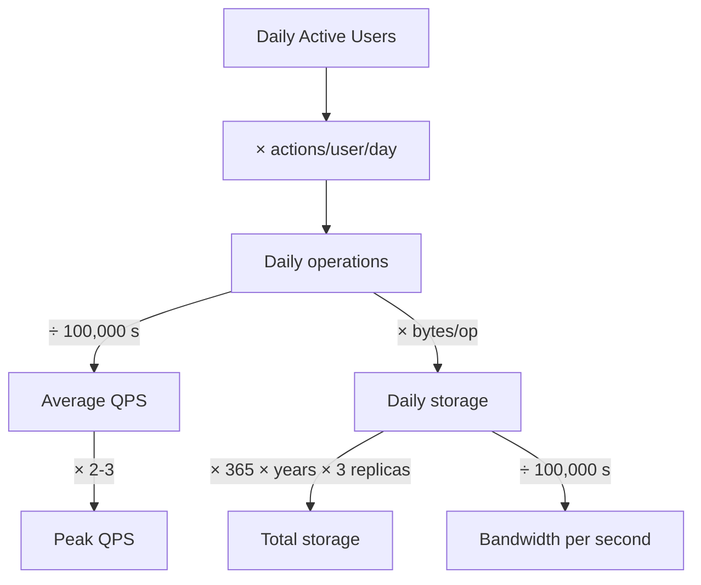

Early in almost every design interview you'll be asked to **size** the system: how many requests
per second, how much storage, how much bandwidth? Nobody wants precision — they want to see you
**reason from a few assumptions to a defensible number** in a couple of minutes. Get comfortable
with a handful of tricks and rounded constants and this becomes mechanical.

## 1. The numbers to memorize

Round hard. The goal is the right **order of magnitude**, not accuracy.

| Quantity | Rounded value | Why it helps |
|--|--|--|
| Seconds in a day | **~100,000** (86,400) | Divide daily totals by 10⁵ to get per-second |
| 1 thousand | 10³ | — |
| 1 million | 10⁶ | — |
| 1 billion | 10⁹ | — |
| Char / small field | ~1 byte | ASCII text |
| Typical record (text + metadata) | ~0.5–1 KB | Tweet, log line, small row |
| Replication factor | ×3 | Standard durability copies |

**Powers of two** (for storage/memory sizing):

| Power | ≈ Value | Name |
|--|--|--|
| 2¹⁰ | ~1 thousand | KB |
| 2²⁰ | ~1 million | MB |
| 2³⁰ | ~1 billion | GB |
| 2⁴⁰ | ~1 trillion | TB |
| 2⁵⁰ | ~10¹⁵ | PB |

:::tip
The single most useful trick: **daily volume ÷ 100,000 ≈ per-second rate.** 100M events/day is
~1,000/s. Memorize `86,400 ≈ 10⁵` and most QPS math becomes a one-line division.
:::

## 2. The estimation pipeline

Every capacity estimate follows the same funnel. State assumptions, then flow downhill.



## 3. Worked example — a Twitter-like feed

Let's size a feed service end to end. State the assumptions, then turn the crank.

```walkthrough
title: Estimate QPS, storage, and bandwidth from DAU
code: |
  DAU              = 100,000,000     # 100M daily active users
  writes/user/day  = 2               # posts created
  reads/user/day   = 100             # timeline views
  bytes/post       = 500             # text + metadata
  seconds/day      ~ 100,000         # 86,400 rounded to 1e5
  retention        = 5 years
  replication      = 3x
steps:
  - text: 'WRITE QPS. Daily writes = 100M users x 2 = 200M/day. Divide by 100,000 s -> ~2,000 writes/sec.'
    line: 2
  - text: 'READ QPS. Daily reads = 100M x 100 = 10 billion/day. Divide by 100,000 s -> ~100,000 reads/sec. Read:write ratio is 50:1 -> heavily read-dominated, so CACHE the read path.'
    line: 3
  - text: 'PEAK QPS. Traffic is bursty; multiply average by ~3 for peaks -> ~6,000 writes/sec and ~300,000 reads/sec. Provision for peak, not average.'
    line: 5
  - text: 'DAILY STORAGE. 200M new posts/day x 500 bytes = 100,000,000,000 bytes = ~100 GB written per day.'
    line: 4
  - text: 'TOTAL STORAGE. 100 GB/day x 365 x 5 years ~ 180 TB of raw data. With 3x replication -> ~540 TB provisioned.'
    line: 6
  - text: 'BANDWIDTH. Write in: 100 GB/day / 100,000 s ~ 1 MB/s. Read out: 10B reads x 500 bytes = 5 TB/day / 100,000 s ~ 50 MB/s. Reads dominate bandwidth too -> a CDN/cache offloads most of it.'
    line: 3
```

The whole point isn't the final numbers — it's what they **imply**: a 50:1 read:write ratio screams
*cache the reads*, ~180 TB rules out a single node (you'll shard), and ~300K peak read QPS means
many app servers behind a load balancer.

:::senior
Always convert numbers into **design decisions**. "~100K read QPS, ~2K write QPS" → read-heavy →
put Redis + a CDN on the read path and don't over-engineer writes. "~180 TB" → won't fit one box →
plan for sharding or a distributed store. Estimation exists to *justify the architecture*, not to
fill a table.
:::

## 4. Reference: latency numbers every programmer should know

Useful when reasoning about whether a design can hit a latency target.

| Operation | Approx latency |
|--|--|
| L1 cache reference | ~1 ns |
| Main memory (RAM) reference | ~100 ns |
| Read 1 MB sequentially from RAM | ~10 µs |
| SSD random read | ~100 µs |
| Round trip within a data center | ~500 µs |
| Read 1 MB from SSD | ~1 ms |
| Disk (HDD) seek | ~10 ms |
| Round trip across continents | ~150 ms |

:::key
Two orders of magnitude jump at each boundary: **RAM ≫ SSD ≫ disk ≫ cross-continent network.** This
is *why* caching in memory and serving from a nearby CDN edge matter so much — every hop you avoid
saves 10–1000×.
:::

## 5. The method, generalized

1. **State assumptions out loud** (DAU, actions/user, object size). Interviewers grade the reasoning.
2. **Round aggressively** — `86,400 → 10⁵`, `500 bytes ≈ 0.5 KB`. Never reach for a calculator.
3. **QPS** = daily operations ÷ 100,000; then **× 2–3 for peak**.
4. **Storage** = daily objects × size × days × replication.
5. **Bandwidth** = daily bytes ÷ 100,000 (do read and write separately).
6. **Interpret** — turn each number into an architectural implication.

:::gotcha
Two classic mistakes: sizing for **average** load (real traffic peaks 2–3× above average — provision
for the spike) and forgetting **replication + overhead** (raw data × 3 for copies, plus indexes and
metadata). Both routinely undersize a design by an order of magnitude.
:::

## Check yourself

```quiz
title: Estimation check
questions:
  - q: 'A service handles 500M requests per day. Roughly what is the average QPS?'
    options:
      - '~500 QPS'
      - text: '~5,000 QPS'
        correct: true
      - '~50,000 QPS'
    explain: 'Divide by ~100,000 seconds/day: 500,000,000 / 100,000 = 5,000 QPS on average. (Peak would be ~2-3x higher.)'
  - q: 'You compute an average of 20,000 read QPS. What should you actually provision for?'
    options:
      - 'Exactly 20,000 QPS — averages are what matter'
      - text: 'Roughly 40,000-60,000 QPS to absorb 2-3x traffic peaks'
        correct: true
      - '2,000 QPS, since caching removes most load'
    explain: 'Real traffic is bursty and peaks well above average. Provisioning only for the average means the system falls over during the daily peak; multiply by 2-3x.'
  - q: 'A design writes 50M objects/day at ~1 KB each, kept for 3 years with 3x replication. Roughly how much storage?'
    options:
      - '~50 GB'
      - text: '~160 TB'
        correct: true
      - '~5 PB'
    explain: '50M x 1 KB = 50 GB/day. x 365 x 3 years ~ 55 TB raw. x 3 replicas ~ 160 TB. Never forget the retention window and replication factor.'
  - q: 'Your estimate shows a 50:1 read-to-write ratio. What is the main design implication?'
    options:
      - 'Shard the write path aggressively'
      - text: 'Cache the read path (Redis / CDN) since reads vastly dominate'
        correct: true
      - 'Use a relational DB with many joins'
    explain: 'A read-dominated workload is the textbook case for caching the read path with Redis and a CDN, absorbing the bulk of traffic. Estimation exists precisely to surface implications like this.'
  - q: 'Why round 86,400 seconds/day to 100,000 during estimation?'
    options:
      - 'It makes the answer more precise'
      - text: 'It keeps the math to mental arithmetic while staying within the right order of magnitude'
        correct: true
      - 'Because there are exactly 100,000 seconds in a day'
    explain: 'Back-of-envelope estimation targets the right order of magnitude, not precision. Rounding to 10^5 turns division into moving a decimal point, and the ~16% error is irrelevant at this altitude.'
```

:::key
Estimation is a fixed pipeline: **DAU × actions → daily ops → ÷ 100,000 = QPS (× 2-3 for peak)**;
**daily objects × size × days × 3 replicas = storage**; **daily bytes ÷ 100,000 = bandwidth**. Round
hard (`86,400 ≈ 10⁵`), memorize the latency ladder (RAM ≫ SSD ≫ disk ≫ network), and always convert
each number into an **architectural decision** — read-heavy → cache, big data → shard.
:::
