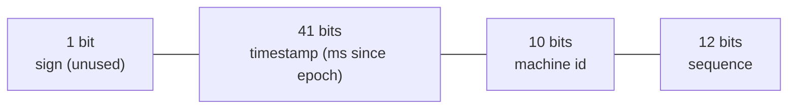

Every distributed system needs to name things — orders, messages, tweets. A single database's `AUTO_INCREMENT` gives unique, sortable IDs but becomes a **coordination bottleneck** and a single point of failure once you shard. The design question: how do many machines each mint IDs that are **globally unique** — and ideally **sortable by time** — without talking to each other?

## The options

| Approach | Unique? | Sortable? | Size | Coordination |
|--|--|--|--|--|
| DB auto-increment | ✅ | ✅ | 8 B | **bottleneck** (one writer) |
| UUID v4 (random) | ✅ | ❌ | 16 B | none |
| UUID v7 (time-based) | ✅ | ✅ (ms) | 16 B | none |
| Ticket server (Flickr) | ✅ | ✅ | 8 B | central, but cheap |
| **Snowflake** | ✅ | ✅ (roughly) | 8 B | none (per-machine) |

- **UUID v4** is trivial and coordination-free, but 128 bits, random (bad for B-tree index locality), and not time-ordered.
- **Ticket servers** hand out ranges from one or two DBs (odd/even auto-increment for HA) — simple, but still a central dependency.
- **Snowflake** (from Twitter) is the classic interview answer: 64-bit, coordination-free, and **k-sorted** by time.

## The Snowflake layout

Pack a 64-bit integer from three fields:



- **41 bits of millisecond timestamp** → ~69 years from a custom epoch, and because it's the high bits, IDs **sort by creation time**.
- **10 bits of machine id** → 1,024 nodes.
- **12 bits of sequence** → 4,096 IDs per millisecond per machine (it resets each ms; if you exhaust it, wait for the next ms).

That's **4,096 × 1,024 ≈ 4.2M IDs/ms** cluster-wide, with no coordination — each machine only needs its own id and a monotonic clock.

```java
long nextId() {
    long ts = currentMillis() - EPOCH;
    if (ts == lastTs) {
        sequence = (sequence + 1) & 0xFFF;      // 12-bit wrap
        if (sequence == 0) ts = waitNextMillis(lastTs);  // exhausted this ms
    } else sequence = 0;
    lastTs = ts;
    return (ts << 22) | (machineId << 12) | sequence;
}
```

:::gotcha
Snowflake IDs are only **"k-sorted"** (roughly time-ordered), not perfectly monotonic — IDs from different machines in the same millisecond interleave. And the scheme assumes a **monotonic clock**: if NTP steps the clock **backward**, you can mint a duplicate. Production implementations refuse to generate IDs while the clock is behind `lastTs` (or borrow from the sequence bits).
:::

:::senior
Match the ID scheme to the access pattern: **UUID v4** when you want zero infrastructure and don't index on it heavily; **Snowflake / UUID v7** when you need time-sortability (feeds, pagination by id, index locality). Mention the **clock-skew failure mode** unprompted — it's the follow-up interviewers wait for. Machine-id assignment itself needs coordination (ZooKeeper/etcd or config) but only **once at startup**, not per ID.
:::

## Check yourself

```quiz
title: Unique IDs check
questions:
  - q: 'Why is a Snowflake ID roughly sortable by time?'
    options:
      - text: 'The millisecond timestamp occupies the high-order bits, so numeric order tracks creation order'
        correct: true
      - 'Because it uses a random UUID internally'
      - 'Because every machine shares one counter'
    explain: 'Putting the timestamp in the most-significant bits makes larger IDs correspond to later times (k-sorted; IDs within the same ms across machines can interleave).'
  - q: 'What is the main risk that can make a Snowflake generator produce a duplicate?'
    options:
      - 'Running out of machine ids'
      - text: 'The clock moving backward (NTP step), reusing a timestamp already issued'
        correct: true
      - 'Using a 64-bit integer'
    explain: 'The timestamp bits assume a monotonic clock. If the clock jumps back, previously used (timestamp, sequence) combinations can repeat, so generators halt until the clock catches up.'
  - q: 'A UUID v4 vs a Snowflake ID — the key trade-off is:'
    options:
      - text: 'UUID v4 needs zero coordination but is random (not time-sortable, worse index locality); Snowflake is 64-bit and time-sortable'
        correct: true
      - 'UUID v4 is always faster to generate and sortable'
      - 'They are identical in size and ordering'
    explain: 'UUID v4 is coordination-free but random and 128-bit; Snowflake is compact and time-ordered, at the cost of needing a machine id and a reliable clock.'
```

:::key
Generate IDs without a coordinator by encoding **time + machine + sequence**. **Snowflake** = 41-bit ms timestamp (high bits → time-sortable, ~69 yrs) + 10-bit machine id (1,024 nodes) + 12-bit sequence (4,096/ms/node). It's k-sorted, 64-bit, and coordination-free — but depends on a **monotonic clock** (guard against backward jumps). UUID v4 (random) or v7 (time-based) are the zero-infra alternatives.
:::
