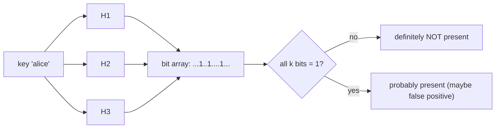

A **Bloom filter** answers *"have I seen this key?"* using a fraction of the memory a real set would need — at the price of occasional false positives. Its guarantee is asymmetric and powerful: **"definitely not present"** is certain; **"probably present"** might be wrong.

## How it works

A bit array of `m` bits plus `k` independent hash functions.

- **Add(x):** hash `x` with all `k` functions, set those `k` bits to 1.
- **Query(x):** hash `x` the same way; if **any** of the `k` bits is 0, `x` is **definitely not** in the set. If **all** are 1, `x` is **probably** in the set (they could have been set by other keys — a **false positive**).



:::key
**No false negatives, only false positives.** If the filter says "not present," it is always right — nothing was ever removed to make a set bit un-set. If it says "present," verify against the real store when correctness matters.
:::

## Why it's worth it

The whole point is to **skip an expensive lookup** for keys that are absent. Put a Bloom filter in front of a slow store; only pay the real cost on a "probably present."

| Used in | To avoid |
|--|--|
| **Cassandra / HBase / RocksDB** (per-SSTable) | reading a disk file that can't contain the key |
| **CDNs / caches** | a backend round-trip for a definitely-missing object |
| **"Username taken?"**, malicious-URL checks | a full DB query on the common negative case |

Trade memory for accuracy: more bits `m` and an optimal `k` shrink the false-positive rate. Roughly, for `n` items the optimal `k ≈ (m/n)·ln 2`, and ~**10 bits per item** gives a ~**1%** false-positive rate — dramatically smaller than storing the keys themselves.

:::gotcha
A standard Bloom filter **cannot delete** — clearing a bit could break other keys that share it. If you must remove items, use a **counting Bloom filter** (small counters instead of bits) or a **cuckoo filter**. Also, once the bit array saturates (too many items for its size), the false-positive rate climbs toward 100%, so size it for the expected `n`.
:::

:::senior
The interview cue is *"check membership at scale with limited memory"* or *"avoid a lookup for keys that mostly don't exist."* Say the guarantee precisely: *"a Bloom filter can have false positives but never false negatives, so I use it as a cheap negative cache in front of the real store and only hit the store on a maybe."* Bonus depth: it also prevents **cache penetration** (a flood of requests for non-existent keys hammering the DB).
:::

## Check yourself

```quiz
title: Bloom filter check
questions:
  - q: 'A Bloom filter reports a key is present. What can you conclude?'
    options:
      - 'The key is definitely in the set'
      - text: 'The key is probably in the set — it may be a false positive, so verify if correctness matters'
        correct: true
      - 'The key was recently deleted'
    explain: 'All k bits being set can result from other keys, so "present" is probabilistic. Only "not present" is certain.'
  - q: 'Which operation is a standard Bloom filter unable to support?'
    options:
      - 'Add'
      - 'Query'
      - text: 'Delete'
        correct: true
    explain: 'Clearing a bit for one key could unset a bit shared with another key, causing false negatives. Use a counting Bloom filter to support deletion.'
  - q: 'Why put a Bloom filter in front of an on-disk store like an LSM-tree SSTable?'
    options:
      - text: 'To skip reading files that definitely do not contain the key, saving disk I/O on the common negative case'
        correct: true
      - 'To sort the keys on disk'
      - 'To compress the data'
    explain: 'A per-SSTable Bloom filter lets the engine avoid touching files that cannot hold the key; it only reads disk when the filter says "maybe."'
```

:::key
A **Bloom filter** = bit array + `k` hashes. Add sets `k` bits; query returns **"definitely absent"** (some bit is 0) or **"probably present"** (all bits 1 — possible false positive). **No false negatives.** Use it as a cheap negative cache to skip expensive lookups (SSTables, caches, "is it taken?"). ~10 bits/item ≈ 1% false positives; it can't delete (use a counting variant).
:::
