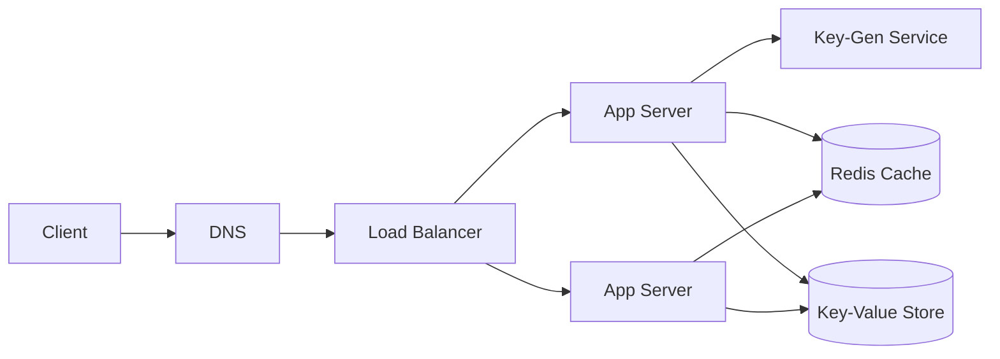
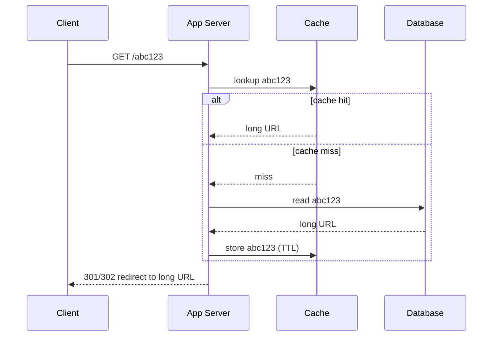

"Design TinyURL" is the canonical warm-up. It looks trivial but exercises the whole toolkit:
**estimation, a clean API, the read/write split, caching, and choosing an ID scheme.**

## 1. Requirements

| Functional | Non-functional |
|--|--|
| Shorten a long URL → short code | **Low latency** redirects (it is in the user path) |
| Redirect short code → original URL | **High availability** (a dead link is worse than a slow one) |
| (Optional) custom alias, expiry, analytics | **Read-heavy**: ~100 reads per write |

## 2. Capacity estimate (back-of-envelope)

Interviewers want to see the math, not precision.

| Quantity | Assumption | Result |
|--|--|--|
| Writes | 100M new URLs/day | ~**1,200 writes/sec** |
| Reads | 100 : 1 read/write | ~**120K reads/sec** |
| Storage | 5 years × 365 × 100M | ~**180B** records |
| Size | ~500 bytes/record | ~**90 TB** |

Read-heavy + tiny records → **cache aggressively**; a key-value store fits better than a relational DB.

## 3. High-level architecture



## 4. The redirect (read) path

The hot path. Cache first; the DB is the fallback.



## 5. How to generate the short key

````tabs
tabs:
  - label: Counter + Base62
    body: |
      A global counter, encoded in base62 (`a-z A-Z 0-9`). **7 chars = 62⁷ ≈ 3.5 trillion** keys.
      ```text
      id = 1,000,000,000  ->  base62  ->  "15ftgG"
      ```
      Short and collision-free, but a single counter is a scaling point — hand out ranges
      to each server (a Key-Gen Service) so they never coordinate per request.
  - label: Hash + check
    body: |
      Hash the long URL (e.g. MD5) and take the first 7 chars.
      ```text
      md5("https://...")[0:7]  ->  "3d2f1a9"
      ```
      Simple and stateless, but must **check for collisions** on write (and identical URLs
      collapse to one code, which may or may not be desired).
````

:::gotcha
Do **not** expose a raw auto-increment integer as the code — it is guessable, lets anyone
enumerate every URL, and leaks your total volume. Encode it (base62) or use a key service.
:::

:::senior
**301 vs 302 matters.** A `301` (permanent) is cached by browsers → fewer hits reach you, but
you lose per-click analytics. A `302` (temporary) sends every click to your servers → accurate
analytics at higher load. The "right" answer depends on whether analytics is a requirement.
:::

## Check yourself

```quiz
title: URL shortener check
questions:
  - q: 'The workload is ~100 reads per write. What is the single most important optimization?'
    options:
      - text: 'A cache in front of the database for reads'
        correct: true
      - 'Sharding all writes across many nodes'
      - 'A relational database with joins'
    explain: 'It is heavily read-dominated, so a cache (Redis) on the redirect path absorbs the vast majority of traffic and keeps latency low. Writes are comparatively rare.'
  - q: 'Why avoid exposing a raw auto-increment ID as the short code?'
    options:
      - 'It would be too long'
      - text: 'It is guessable/enumerable and leaks total volume'
        correct: true
      - 'Integers cannot be put in a URL'
    explain: 'Sequential IDs let anyone walk every link and infer how many you have created. Base62-encode it or use a key-generation service.'
  - q: 'Choosing a `301` (permanent) redirect over `302` mainly costs you:'
    options:
      - 'Correctness'
      - text: 'Per-click analytics (browsers cache 301s)'
        correct: true
      - 'Availability'
    explain: 'A 301 is cached by the browser, so repeat visits never hit your server — great for load, but you lose the click data a 302 would capture.'
```

:::key
URL shortener = a **read-heavy key→value lookup**. Estimate first (~120K reads/s, ~90 TB), put a
**cache on the redirect path**, use a **key-value store**, and generate codes with **base62 or a
key service** (never a raw counter). Know the **301 vs 302** trade-off.
:::
