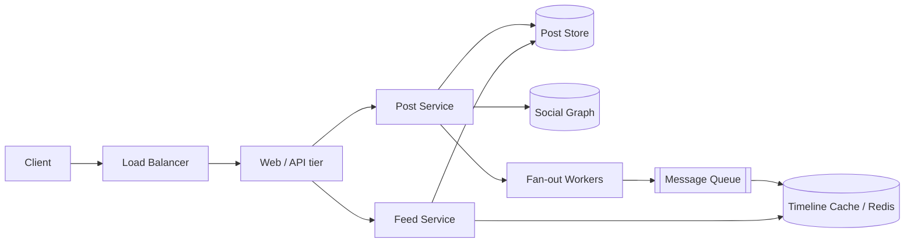
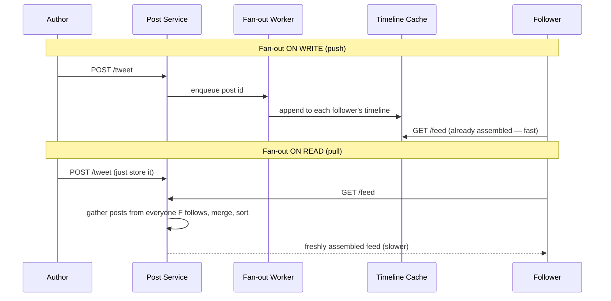

"Design the Twitter timeline" (or the Instagram/Facebook feed) is the classic **read-vs-write
trade-off** interview. The whole problem reduces to one question: **when do you do the work of
assembling a feed — at write time, or at read time?**

## 1. Requirements

| Functional | Non-functional |
|--|--|
| Post a tweet/photo | **Low latency** feed load (< 200 ms, it is user-facing) |
| See a home feed of people you follow, newest first | **High availability** — a stale feed beats no feed |
| Follow / unfollow users | **Eventual consistency** is fine (a post can appear a few seconds late) |
| (Optional) likes, ranking, media | **Read-heavy**: people scroll far more than they post |

## 2. Capacity estimate (back-of-envelope)

| Quantity | Assumption | Result |
|--|--|--|
| Daily active users | 300M DAU | — |
| Posts | 0.5 posts/user/day | ~**1.7K writes/sec** |
| Feed reads | 10 feed loads/user/day | ~**35K reads/sec** |
| Fan-out | avg 200 followers/post | ~**340K timeline writes/sec** |
| Feed cache | 300M users × ~800 bytes hot feed | ~**240 GB** in Redis |

The fan-out multiplier is the whole story: **one write becomes hundreds of writes.** That is
manageable on average — until a celebrity with 100M followers posts.

## 3. High-level architecture



Writing a post persists it, then hands off to **async fan-out workers** via a queue — the poster
gets an instant `200 OK` while the timelines fill in behind them.

## 4. The core decision: fan-out on write vs read



- **Fan-out on write (push):** do the work when someone posts — pre-compute every follower's
  timeline. **Reads are trivially fast**, but a post costs O(followers) writes.
- **Fan-out on read (pull):** do the work when someone loads their feed — gather and merge on
  demand. **Writes are cheap**, but reads are expensive and repeated.

````tabs
tabs:
  - label: Fan-out on write (push)
    body: |
      Pre-materialize each follower's timeline in Redis at post time.
      ```text
      onPost(author, postId):
        for follower in followers(author):
          LPUSH timeline:{follower} postId
      ```
      **Pro:** feed load is a single cache read.
      **Con:** a 100M-follower celebrity = 100M writes per tweet — a write storm and huge
      write amplification for users who may never log in.
  - label: Fan-out on read (pull)
    body: |
      Store the post once; assemble feeds lazily.
      ```text
      getFeed(user):
        ids = union(recentPosts(f) for f in following(user))
        return sort(ids, by=time)[:N]
      ```
      **Pro:** posting is O(1); no wasted work for inactive followers.
      **Con:** every feed load fans out across hundreds of followees — slow and hot on read.
  - label: Hybrid (production answer)
    body: |
      **Push for normal users, pull for celebrities.**
      ```text
      onPost(author):
        if followers(author) < THRESHOLD:  # e.g. < 10k
          push to followers' timelines
        else:
          skip fan-out (mark as celebrity)

      getFeed(user):
        base = timeline:{user}            # pushed posts
        extra = recentPosts(celebs user follows)  # pulled at read
        return merge(base, extra)
      ```
      Best of both: cheap posts for the famous, cheap reads for everyone.
````

:::gotcha
**The celebrity / hot-key problem** breaks naive fan-out-on-write. A single celebrity post
would trigger tens of millions of timeline writes, saturating the queue and delaying everyone
else's posts. Detect high-follower accounts and **switch them to pull** — merge their recent
posts into the feed at read time instead.
:::

:::senior
**Ranking changes the storage shape.** A pure reverse-chronological feed can store just post
IDs in a list. The moment you add ML ranking (engagement, recency, affinity), the feed becomes
a *candidate-generation + scoring* pipeline: fan-out produces candidates, a ranking service
scores them per request. Mention that you'd keep fan-out for candidate generation and rank on
read — you rarely pre-compute a ranked feed because the model and signals change constantly.
:::

## Check yourself

```quiz
title: News feed check
questions:
  - q: 'Why is fan-out on write (push) the default for the vast majority of users?'
    options:
      - text: 'It makes the common operation — reading the feed — a single fast cache lookup'
        correct: true
      - 'It uses less storage than pull'
      - 'It guarantees strong consistency'
    explain: 'Feeds are read far more than they are written. Pre-materializing timelines moves the cost to write time so reads are O(1) — exactly what a read-heavy workload wants.'
  - q: 'A celebrity with 80M followers posts. Why does pure fan-out on write fall over?'
    options:
      - 'The post is too large to store'
      - text: 'One post triggers ~80M timeline writes — a write storm that backs up the queue'
        correct: true
      - 'Followers cannot be looked up quickly'
    explain: 'Fan-out on write is O(followers). For a huge account that is tens of millions of writes per post, saturating the fan-out pipeline and delaying everyone.'
  - q: 'What does the hybrid approach actually do?'
    options:
      - 'Pushes for everyone but caches reads'
      - text: 'Pushes posts for normal accounts; pulls celebrities'' posts in at read time and merges'
        correct: true
      - 'Randomly picks push or pull per request'
    explain: 'Normal accounts fan out on write (cheap reads). Celebrity posts skip fan-out and are merged into the feed on read, avoiding the write storm.'
```

:::key
News feed = the **fan-out trade-off**. **Push** (fan-out on write) makes reads fast but posts
expensive; **pull** (fan-out on read) makes posts cheap but reads expensive. Production uses a
**hybrid**: push for normal users, **pull for celebrities** to dodge the hot-key write storm.
Timelines live in a **Redis cache**; fan-out runs **async via a queue**.
:::
