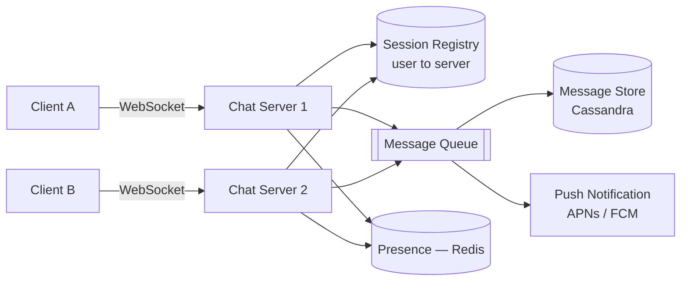
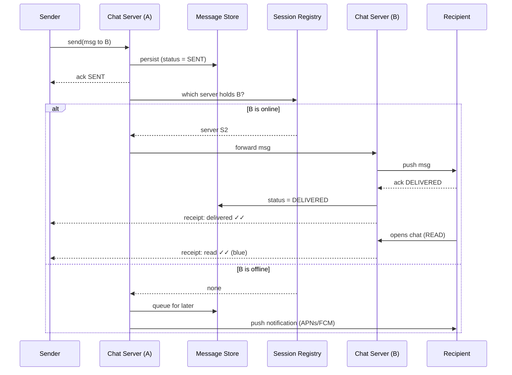

"Design WhatsApp" is a **stateful-connection** interview. Unlike a request/response API, chat
servers must hold **millions of long-lived connections** and push messages to whoever happens
to be online *right now*. The interesting parts are connection routing, delivery guarantees,
presence, and storage.

## 1. Requirements

| Functional | Non-functional |
|--|--|
| 1:1 and group messaging | **Low latency** delivery (feels real-time) |
| Delivery + read receipts (sent / delivered / read) | **Reliable** — no lost messages, even if offline |
| Online / last-seen presence | **Highly available**, horizontally scalable |
| Offline delivery (store & forward) | **Ordered** messages within a conversation |

## 2. Capacity estimate (back-of-envelope)

| Quantity | Assumption | Result |
|--|--|--|
| Daily active users | 500M DAU | — |
| Messages | 40 messages/user/day | ~**230K messages/sec** |
| Concurrent connections | 20% online at peak | ~**100M** live WebSockets |
| Conns per server | ~65K per box (fd/mem bound) | ~**1,500+** chat servers |
| Storage | 20B msgs/day × ~200 bytes | ~**4 TB/day** |

The dominant constraint is **connection count**, not CPU. You size the fleet by *how many
sockets a box can hold*, and you need a way to find which box holds any given user.

## 3. High-level architecture



Each client holds a persistent WebSocket to *some* chat server. A **session registry** (Redis)
maps `user → server`, so a message for user B can be routed to whichever server B is connected
to. Offline users get a **push notification** instead.

## 4. Send → deliver → ack



The message is **persisted before it is acknowledged** — so it survives even if the recipient
is offline or a server dies. Receipts (`sent → delivered → read`) are just status updates
flowing back to the sender.

## 5. Key design decisions

````tabs
tabs:
  - label: Connection protocol
    body: |
      **WebSocket** for the bidirectional, low-latency link — the server must *push*, so
      plain HTTP request/response won't do.
      ```text
      client --- persistent WebSocket ---> chat server
      server can push at any time (new msg, receipt, presence)
      ```
      Long-polling is the fallback for restricted networks, but WebSocket is the default.
  - label: Message storage
    body: |
      A **wide-column store (Cassandra / HBase)**: partition by `conversation_id`, cluster
      by message timestamp/id so a chat history is a single ordered partition read.
      ```text
      PK: (conversation_id, message_id)   # message_id is time-ordered (e.g. Snowflake)
      ```
      Huge write volume + simple access pattern (append + range scan) → NoSQL over an RDBMS.
  - label: Presence
    body: |
      Store `user → {status, last_seen}` in **Redis with a TTL**. The client sends a
      heartbeat; if it stops, the key expires and the user goes offline.
      ```text
      SET presence:{user} online EX 30   # refreshed by heartbeat
      ```
      Don't broadcast presence to everyone — only to a user's active conversation partners.
  - label: Group chat
    body: |
      Small groups: **fan-out** the message to each member's connection (like 1:1, N times).
      ```text
      onGroupMsg(g, msg):
        for member in members(g):
          route(member, msg)
      ```
      Cap group size (e.g. 256) so fan-out stays bounded. Store the message once, keyed by the
      group's conversation id.
````

:::gotcha
**Message ordering** is subtle. Wall-clock timestamps from clients drift and collide. Assign a
**server-side monotonic id** (e.g. a Snowflake id: timestamp + sequence) per conversation so
messages sort deterministically and duplicates (from retries) can be de-duped by id.
:::

:::senior
**Delivery semantics are at-least-once, made idempotent.** Networks drop acks, so senders
retry — which means the recipient can receive the same message twice. Give every message a
unique client-generated id and **de-dupe on the receiver**. Aiming for exactly-once at the
transport layer is a trap; at-least-once + idempotent apply is how real systems do it.
:::

## Check yourself

```quiz
title: Chat system check
questions:
  - q: 'Why WebSocket instead of ordinary HTTP request/response for message delivery?'
    options:
      - 'WebSocket is more secure'
      - text: 'The server must push messages to the client at any time — HTTP can''t initiate'
        correct: true
      - 'HTTP cannot carry text'
    explain: 'Chat needs the server to send data unprompted (new messages, receipts, presence). A persistent bidirectional WebSocket enables server push; classic HTTP is client-initiated only.'
  - q: 'A message for user B must be persisted before the sender is told "delivered". Why?'
    options:
      - text: 'So the message survives if B is offline or a server crashes — no lost messages'
        correct: true
      - 'To make the sender wait longer'
      - 'Because Cassandra requires it'
    explain: 'Persisting first (store-and-forward) guarantees durability. If B is offline the message waits in the store; if a server dies it is not lost. Acks and receipts follow from the persisted state.'
  - q: 'How do you locate which of 1,500 chat servers holds a given online user?'
    options:
      - 'Broadcast the message to every server'
      - text: 'A session registry (e.g. Redis) mapping user → connected server'
        correct: true
      - 'Store the connection in the client'
    explain: 'A session registry maps each user to the server holding their WebSocket, so a message can be routed directly. If the user isn''t in the registry, they''re offline → send a push notification.'
```

:::key
Chat = **millions of stateful WebSocket connections**. Size the fleet by **connections per
box**, route with a **session registry (user → server)**, and **persist before ack** for
store-and-forward durability. Storage is a **wide-column store partitioned by conversation**;
**presence** is Redis + TTL heartbeats; delivery is **at-least-once + idempotent de-dupe**.
:::
