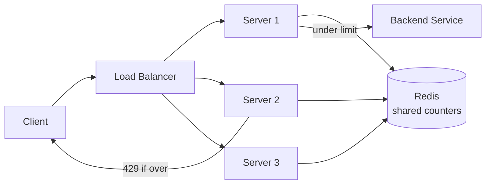

"Design a rate limiter" tests whether you understand **shared state across a fleet**. Limiting
requests on one box is trivial; the real problem is enforcing "100 requests/min **per user**"
when that user's requests are sprayed across 50 servers behind a load balancer.

## 1. Requirements

| Functional | Non-functional |
|--|--|
| Cap requests per client (user / IP / API key) | **Low latency** — it sits in front of every request |
| Return `429 Too Many Requests` when over limit | **Accurate enough** across the whole fleet |
| Configurable rules (per route, per tier) | **Highly available** — must not become a SPOF |
| Expose limit headers (`X-RateLimit-Remaining`) | **Fail open** on limiter outage (usually) |

## 2. Where does the counter live?



The insight: **counters cannot live in each server's memory** — a user hitting three servers
would get 3× their limit. Put the counters in a **shared, fast store (Redis)** that every
server reads and writes atomically. Redis is the right fit: in-memory speed, atomic
`INCR`/Lua scripts, and TTLs for free window expiry.

## 3. Token-bucket accounting

The most popular algorithm: each client has a bucket that **refills at a steady rate** up to a
**capacity**. Each request costs one token; no token → reject.

```walkthrough
title: Token bucket — capacity 5, refill 1 token/sec
code: |
  refill = (now - last) * rate
  tokens = min(capacity, tokens + refill)
  if (tokens >= 1) { tokens -= 1; allow(); }
  else            { reject();          }  // 429
steps:
  - text: 'Bucket starts full: 5 tokens. Request arrives → allowed, spend 1.'
    array: [1, 1, 1, 1, 0]
    highlight: [0]
    line: 3
  - text: 'Three quick requests spend three more tokens. 1 left.'
    array: [1, 0, 0, 0, 0]
    highlight: [1, 2, 3]
    sorted: [4]
    line: 3
  - text: 'Fifth request spends the last token — bucket now empty.'
    array: [0, 0, 0, 0, 0]
    highlight: [4]
    sorted: [4]
    line: 3
  - text: 'Sixth request arrives instantly: 0 tokens → REJECTED (429).'
    array: [0, 0, 0, 0, 0]
    sorted: [0, 1, 2, 3, 4]
    line: 4
  - text: 'Wait 2 seconds: refill adds 2 tokens (rate 1/sec). Requests flow again.'
    array: [1, 1, 0, 0, 0]
    highlight: [0, 1]
    line: 2
```

Because the bucket can hold up to `capacity` tokens, token bucket **allows short bursts** while
still bounding the long-run average — usually what you actually want.

## 4. Algorithm choice

| Algorithm | How it works | Bursts? | Memory | Notes |
|--|--|--|--|--|
| **Token bucket** | Refill tokens at rate R, cap at C | Yes (up to C) | O(1) per key | Most common; smooth + bursty |
| **Leaky bucket** | Queue drains at fixed rate | No — smooths output | O(queue) | Good for steady outflow (traffic shaping) |
| **Fixed window** | Count per aligned window (e.g. per minute) | Spiky at edges | O(1) | Simplest; **2× burst** at window boundary |
| **Sliding window log** | Timestamps of every request | Exact | O(N) per key | Precise but memory-heavy |
| **Sliding window counter** | Weighted blend of current + previous window | Smoothed | O(1) | Great accuracy/memory trade-off |

````tabs
tabs:
  - label: Fixed window (simple, flawed)
    body: |
      One counter per aligned time window, incremented atomically.
      ```text
      key = user:{id}:{floor(now/60)}
      INCR key ; EXPIRE key 60
      if count > limit -> 429
      ```
      Cheap and easy — but a client can send `limit` requests at 0:59 and `limit` more at
      1:00, i.e. **2× the limit** across the boundary.
  - label: Sliding window counter (recommended)
    body: |
      Blend the previous window's count by how far into the current window you are.
      ```text
      est = prev * (1 - elapsed_fraction) + curr
      if est > limit -> 429
      ```
      Kills the boundary burst of fixed window while staying O(1) memory — the usual
      production choice.
  - label: Token bucket in Redis (atomic)
    body: |
      Store `{tokens, last_refill}` per key and update it in a **single Lua script** so the
      read-modify-write can't interleave across servers.
      ```lua
      -- KEYS[1]=bucket  ARGV: now, rate, capacity
      local b = redis.call('HMGET', KEYS[1], 'tokens', 'ts')
      -- refill, spend or reject, HSET back — all atomic
      ```
      One round trip, no race, works identically from every server.
````

:::gotcha
**Read-then-write races.** `GET count` → `if under limit` → `INCR` is **not atomic** — two
servers can both read `99`, both allow, and blow past the limit. Do the whole check-and-update
in **one atomic operation**: `INCR` + compare, or a **Lua script** for token bucket. This is
the mistake interviewers are listening for.
:::

:::senior
**Decide the failure mode explicitly.** If Redis is down, do you **fail open** (allow all
traffic — protect user experience) or **fail closed** (reject all — protect the backend)? Most
public APIs fail open, because a limiter outage shouldn't take down the product. Also mention a
**local in-memory fallback** (approximate limiting per node) and syncing counters
asynchronously to survive short Redis blips without a hard dependency on the network per request.
:::

## Check yourself

```quiz
title: Rate limiter check
questions:
  - q: 'Why must the counters live in a shared store (Redis) rather than each server''s memory?'
    options:
      - 'Redis is cheaper than RAM'
      - text: 'A load balancer spreads a user across many servers; per-server counters would each allow the full limit'
        correct: true
      - 'In-memory counters cannot expire'
    explain: 'With per-server memory, a user hitting N servers gets up to N× the limit. A shared store gives every server one consistent view of the count.'
  - q: 'What is the classic bug in `GET count; if under limit; INCR`?'
    options:
      - 'It is too slow'
      - text: 'It is not atomic — two servers can both read the same value and both allow, exceeding the limit'
        correct: true
      - 'INCR resets the TTL'
    explain: 'The read and the write can interleave across servers. Use a single atomic op (INCR then compare) or a Lua script so the check-and-update is indivisible.'
  - q: 'What edge-case problem does the fixed-window counter have?'
    options:
      - text: 'A burst straddling the window boundary can allow up to 2× the limit'
        correct: true
      - 'It uses unbounded memory'
      - 'It cannot expire keys'
    explain: 'Sending `limit` requests just before the window rolls over and `limit` just after allows 2× the limit in a short span. Sliding-window approaches smooth this out.'
```

:::key
Distributed rate limiter = **shared counters in Redis**, updated **atomically** (INCR or a Lua
script — never read-then-write). **Token bucket** allows bounded bursts and is the go-to;
**sliding-window counter** fixes fixed-window's 2× boundary burst at O(1) memory. Decide
**fail-open vs fail-closed** for when the limiter itself is down.
:::
