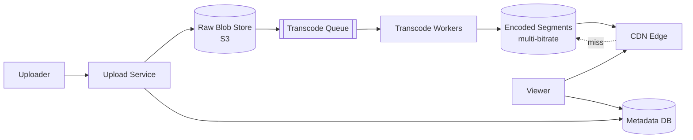
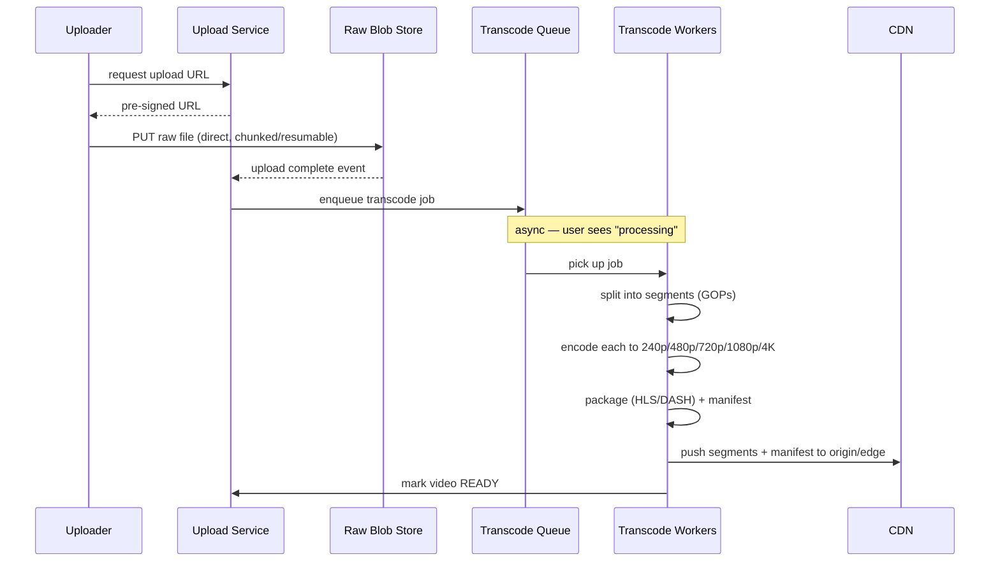

"Design YouTube" is a **big-blob + big-fan-out** interview. Two very different problems live
side by side: an offline **ingestion pipeline** (upload and process huge files) and an online
**delivery** problem (stream to millions with low buffering). The magic word is **CDN**, and
the magic technique is **adaptive bitrate streaming**.

## 1. Requirements

| Functional | Non-functional |
|--|--|
| Upload a video | **High availability** and durability (never lose an upload) |
| Watch/stream a video smoothly | **Low startup latency** + minimal buffering |
| Adapt quality to network (240p → 4K) | **Massive read scale** — one video, millions of viewers |
| Search, recommend, comment | **Reliable processing** — transcode can be slow/async |

## 2. Capacity estimate (back-of-envelope)

| Quantity | Assumption | Result |
|--|--|--|
| Uploads | 500 hrs of video/min | ~**30K hrs/hour** ingested |
| Raw storage/yr | 500 hrs/min × ~1 GB/hr raw | ~**260 PB/year** (× formats) |
| Read : write | streaming vs upload | ~**1000 : 1** read-heavy |
| Egress | tens of Tbps at peak | **served almost entirely by CDN** |

The read:write ratio (~1000:1) and the sheer egress mean **you cannot serve video from origin**
— the CDN does the heavy lifting. Origin storage is durable and cheap; the CDN is fast and close.

## 3. High-level architecture



Two separate stores: a **metadata DB** (title, owner, views — small, relational/queryable) and
a **blob store** for the video bytes (S3-style object storage). The player fetches metadata from
the API but streams the actual bytes from the **CDN edge** closest to the viewer.

## 4. The upload / encode pipeline



Notice the client uploads the raw bytes **directly to blob storage** via a pre-signed URL —
never through the app servers. Then everything is **async**: transcoding one video into many
resolutions is CPU-heavy and slow, so it runs on a worker fleet fed by a queue while the user
sees "processing."

## 5. Key design decisions

````tabs
tabs:
  - label: Adaptive bitrate (ABR)
    body: |
      Each video is encoded into **multiple bitrate ladders** and chopped into short
      **segments** (2–10 s). A **manifest** lists them; the player picks the highest quality
      its current bandwidth can sustain, **switching per segment**.
      ```text
      manifest.m3u8 -> [ 240p/seg1..N, 720p/seg1..N, 1080p/seg1..N ]
      player: measure throughput -> request next segment at best fitting rate
      ```
      This is why quality dips then recovers instead of buffering — the player downshifts a
      segment rather than stalling. Protocols: **HLS** (Apple) and **MPEG-DASH**.
  - label: Metadata vs blob split
    body: |
      Store the two very differently:
      ```text
      Metadata DB  : title, description, uploader, tags, view count  (small, queryable)
      Blob store   : encoded video segments + thumbnails             (huge, immutable)
      ```
      Metadata is queried/searched/joined; blobs are write-once, read-many binary. Mixing
      them in one DB wastes money and kills query performance.
  - label: CDN delivery
    body: |
      Push (or pull-on-miss) encoded segments to **CDN edge nodes** worldwide. Viewers stream
      from the nearest edge; the origin only serves cache misses.
      ```text
      viewer -> nearest edge (hit)     # ~99% of traffic
      edge   -> origin (miss, first request in region)
      ```
      This is the only way to serve tens of Tbps at low latency and reasonable cost.
````

:::gotcha
**Don't stream from origin, and don't upload through your app servers.** Both are classic
mistakes. Uploads go **client → blob store directly** (pre-signed URL, resumable/chunked so a
dropped connection doesn't restart a 4 GB upload). Delivery goes **CDN → viewer**, with origin
touched only on a cache miss. Your app servers handle metadata and orchestration, not bytes.
:::

:::senior
**Transcoding is a DAG of parallel jobs, not one big task.** Split the source into segments
(GOP boundaries), fan those out across many workers to encode each resolution independently,
then stitch and package. This makes a long video finish fast, lets you retry a single failed
segment instead of the whole file, and lets you add a new codec (say AV1) by re-running only the
encode stage. Prioritize the resolutions most viewers need first so playback can start before
every ladder finishes.
:::

## Check yourself

```quiz
title: Video streaming check
questions:
  - q: 'Why is a CDN essential for a video streaming service?'
    options:
      - 'It transcodes the video'
      - text: 'It serves the bytes from edges near viewers, absorbing massive read egress the origin never could'
        correct: true
      - 'It stores the only copy of the video'
    explain: 'Streaming is ~1000:1 read-heavy at tens of Tbps. CDN edges cache segments close to viewers, so the origin handles only misses. Serving all of that from origin is infeasible on latency and cost.'
  - q: 'What does adaptive bitrate streaming (HLS/DASH) actually do?'
    options:
      - 'Compresses the whole file to one small size'
      - text: 'Encodes multiple quality ladders in short segments; the player picks the best rate its bandwidth allows, per segment'
        correct: true
      - 'Downloads the full video before playing'
    explain: 'The video is chopped into short segments at several bitrates. The player measures throughput and requests the next segment at the quality it can sustain, downshifting instead of stalling.'
  - q: 'Why split metadata (title, views) from the video bytes into different stores?'
    options:
      - 'To make uploads slower'
      - text: 'Metadata is small and queryable; video bytes are huge, immutable blobs — different access patterns and stores'
        correct: true
      - 'Because a blob store cannot store text'
    explain: 'Metadata needs querying/search/joins in a DB; encoded video is write-once read-many binary best kept in object storage and fronted by a CDN. Mixing them hurts cost and query performance.'
```

:::key
Video streaming = **offline pipeline + online delivery**. Upload goes **client → blob store**
(pre-signed, resumable), then **async transcode** into a **multi-bitrate ladder of segments**.
Serve via **CDN edges** (never origin), and let the player do **adaptive bitrate** per segment.
Keep **metadata (queryable DB)** separate from **blobs (object store)**.
:::
