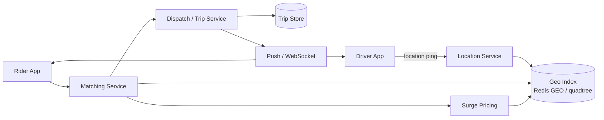
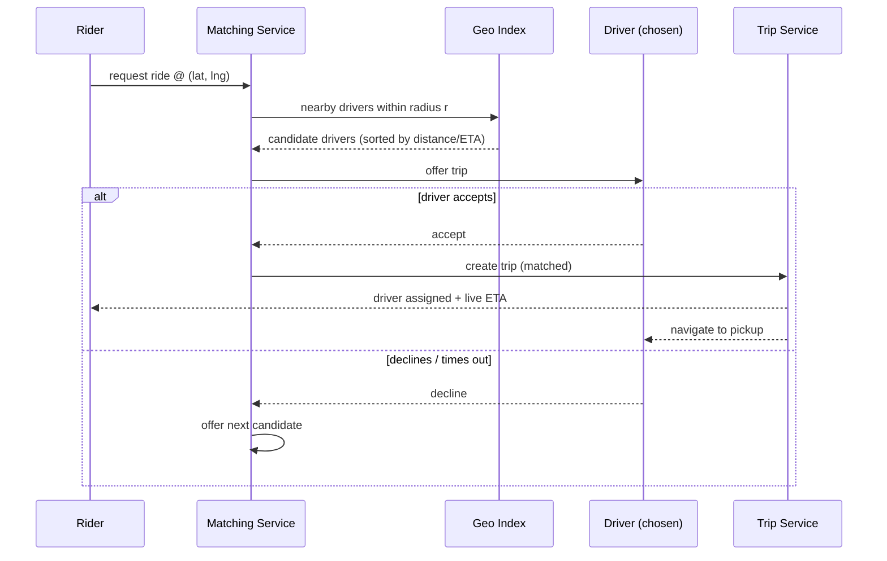

"Design Uber" is a **geospatial + real-time matching** interview. The hard part isn't the
CRUD — it's answering *"which drivers are near this rider?"* millions of times a second while
drivers' locations change every few seconds. That means **geo-indexing** plus a firehose of
**location updates**.

## 1. Requirements

| Functional | Non-functional |
|--|--|
| Drivers publish live location | **Low latency** matching (riders wait seconds, not minutes) |
| Riders request a ride; match to a nearby driver | **High write throughput** — constant location pings |
| Track trip state; ETA & pricing | **High availability** in each city/region |
| Surge pricing under high demand | **Approximate location** is acceptable (eventually consistent) |

## 2. Capacity estimate (back-of-envelope)

| Quantity | Assumption | Result |
|--|--|--|
| Active drivers | 5M online at peak | — |
| Location updates | 1 ping / 4 sec / driver | ~**1.25M writes/sec** |
| Ride requests | matches | ~**tens of K/sec** |
| Location store | 5M drivers × small record | fits **in-memory (Redis geo)** per region |

The dominant load is the **location-update firehose** (~1M+ writes/sec), not the ride requests.
That pushes you to an **in-memory geo index**, sharded by region, absorbing constant updates.

## 3. High-level architecture



Location pings flow into a **Location Service** that keeps a live **geo index**, sharded by
region so each shard handles one city's writes. The **Matching Service** queries that index for
nearby drivers; **Dispatch** manages the trip lifecycle and notifies both parties.

## 4. Ride request → match



Matching is a **query the geo index → offer → confirm** loop: find candidates near the rider,
offer to the best one, and fall through to the next if they decline or time out.

## 5. Geo-indexing: how to find "drivers near me"

````tabs
tabs:
  - label: Geohash
    body: |
      Encode (lat, lng) into a short **string** where a shared prefix ⇒ physical proximity.
      Truncate to control cell size.
      ```text
      (37.7749, -122.4194) -> "9q8yyk"
      neighbors share prefix "9q8yy" -> nearby drivers = same/adjacent buckets
      ```
      Store `driver → geohash` in Redis; query the rider's cell plus its 8 neighbors. Simple,
      shardable, works great with a KV store. **Edge case:** two points across a cell boundary
      can be close yet differ early — always check neighboring cells.
  - label: Quadtree
    body: |
      Recursively subdivide space into 4 quadrants, splitting a cell only when it holds too
      many drivers — so dense downtowns get fine cells, empty areas stay coarse.
      ```text
      root -> NW NE SW SE -> subdivide hot cells further
      query: descend to the rider's leaf, gather nearby leaves
      ```
      Adapts to density (great for uneven cities) but is an in-memory tree that must be
      rebalanced as drivers move — more complex than geohash.
  - label: Redis GEO (pragmatic)
    body: |
      Redis has built-in geospatial commands backed by geohash-scored sorted sets.
      ```text
      GEOADD drivers:sf  -122.4194 37.7749  driver:42
      GEOSEARCH drivers:sf FROMLONLAT ... BYRADIUS 3 km ASC
      ```
      In an interview this is the fast, credible "I'd use Redis GEO, sharded per region" answer.
````

:::gotcha
**Don't store driver locations in your primary SQL database.** At ~1M+ location updates/sec,
row updates and B-tree index churn will melt an RDBMS. Keep the live index **in memory** (Redis
GEO / an in-process quadtree), sharded by region, and only persist trip records (the durable,
low-volume data) to the database.
:::

:::senior
**Surge is supply/demand per geo cell, and it feeds back into matching.** Compute a multiplier
from the ratio of open requests to available drivers **within each geohash cell**, updated on a
short interval. Two subtleties worth raising: surge must be **regionally sharded** (SF's surge
is independent of NYC's), and it creates a **feedback loop** — higher prices attract drivers and
suppress demand, cooling the surge. Show it as a streaming aggregation over the location index,
not a global constant.
:::

## Check yourself

```quiz
title: Ride-sharing check
questions:
  - q: 'What is the dominant load in a ride-sharing system?'
    options:
      - 'Ride requests'
      - text: 'The continuous stream of driver location updates (~1M+ writes/sec)'
        correct: true
      - 'Payment processing'
    explain: 'Every online driver pings its location every few seconds. Millions of drivers make location updates — not ride requests — the throughput driver, which is why the geo index is kept in memory.'
  - q: 'Why use a geohash (or quadtree) instead of a SQL query with lat/lng ranges?'
    options:
      - 'SQL cannot store decimals'
      - text: 'Geo-indexing turns "who is near me" into a fast prefix/bucket lookup instead of scanning a huge table'
        correct: true
      - 'Geohashes are more accurate than coordinates'
    explain: 'Geohash maps proximity to shared string prefixes (and quadtrees to nearby leaves), so nearby drivers sit in the same/adjacent buckets — an O(1)-ish lookup versus a range scan over millions of moving rows.'
  - q: 'A gotcha with geohash cells is that two nearby points can fall in different cells. How do you handle it?'
    options:
      - 'Use larger cells only'
      - text: 'Query the rider''s cell plus its 8 neighboring cells'
        correct: true
      - 'Ignore it — it rarely matters'
    explain: 'Points just across a cell boundary can be physically close but differ early in the hash. Searching the rider''s cell and its 8 neighbors catches drivers near the edges.'
```

:::key
Ride-sharing = **geo-indexing + real-time matching**. The heavy load is the **location-update
firehose**, so keep an **in-memory geo index** (**geohash** buckets or a **quadtree**, or Redis
GEO), **sharded by region**. Match by querying the index for nearby drivers, then offer/confirm.
Persist only **trip records** to a DB; compute **surge per geo cell** from supply vs demand.
:::
