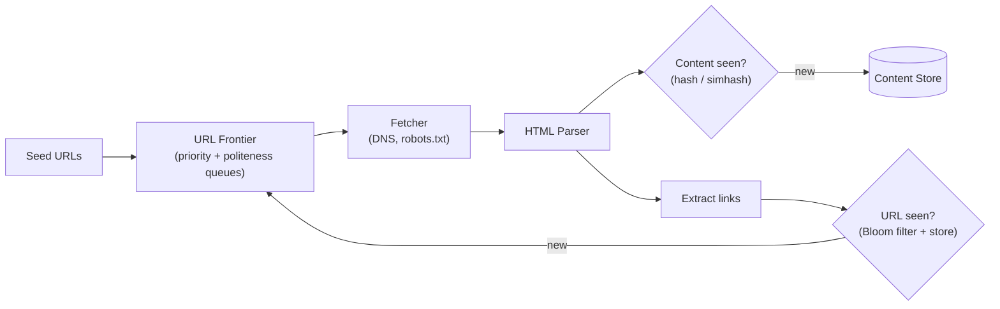
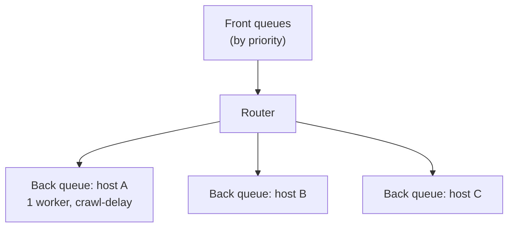

"Design a web crawler" tests breadth: queueing, dedup, politeness, and scale all in one. Follow the [framework](/system-design/topic/interview/the-framework) — clarify, estimate, then draw the data flow.

## Step 1 — Requirements

| Dimension | Question | Assumption |
|--|--|--|
| Scale | How many pages? | ~1B pages/month |
| Politeness | Respect robots.txt & rate limits? | **Yes** — never hammer a host |
| Freshness | Re-crawl changed pages? | Yes, by change frequency |
| Content | HTML only? | HTML now; pluggable parsers later |
| Dedup | Skip already-seen URLs & duplicate content? | Both |

**Estimate:** 1B/month ≈ **~400 pages/sec** average; assume ~500 KB/page ≈ **500 TB/month** of raw content. That scale forces a **distributed** crawler.

## Step 2 — The data flow



## Step 3 — The URL Frontier (the heart)

The frontier isn't a plain queue — it balances two competing goals:

- **Prioritization** — crawl important/fresh pages first (front queues bucketed by priority: PageRank, update rate).
- **Politeness** — never overwhelm one host (back queues, **one per host**, each drained by a single worker with a per-host delay).



:::senior
The politeness design is the differentiator. Mapping **one back-queue per host to one worker thread** guarantees you never issue concurrent requests to the same domain and can honor `Crawl-delay`. Say it explicitly: *"front queues decide **what** to crawl next; back queues, keyed by host, decide **when**, so we stay polite."*
:::

## Step 4 — De-duplication (two kinds)

- **URL dedup** — before enqueuing, check a **[Bloom filter](/system-design/topic/components/bloom-filters)** of seen URLs (cheap negative check), backed by a durable store for confirmation. Normalize URLs first (lowercase host, strip fragments, sort query params).
- **Content dedup** — different URLs often serve identical or near-identical pages. Hash the content (exact) or **SimHash** (near-duplicate) and skip storing repeats.

## Step 5 — The traps and the polish

:::gotcha
Crawlers get stuck in **spider traps** — infinite calendars, session-id URLs that never repeat, deep dynamic links. Bound it: cap URL length and crawl depth, budget pages per domain, and detect near-duplicate content. Also cache **DNS** (resolution is a hidden per-request cost) and honor **robots.txt** (fetch and cache it per host).
:::

- **Freshness:** re-crawl frequently-changing pages more often (adaptive interval from observed change rate).
- **Distribution:** shard the frontier by `hash(host)` so each crawler node owns whole domains — that keeps politeness local (no cross-node coordination per host).
- **Storage:** raw pages in blob storage/HDFS; a metadata store for URL → last-crawled/etag.

## Check yourself

```quiz
title: Web crawler check
questions:
  - q: 'What is the primary job of the URL frontier?'
    options:
      - text: 'Decide what to crawl next (priority) while enforcing politeness (per-host rate limits)'
        correct: true
      - 'Store the downloaded HTML'
      - 'Render JavaScript'
    explain: 'The frontier balances prioritization (front queues) with politeness (per-host back queues), controlling both the order and the rate of crawling.'
  - q: 'Why keep one back-queue per host, each served by a single worker?'
    options:
      - text: 'To guarantee you never send concurrent requests to the same domain and can honor its crawl-delay'
        correct: true
      - 'To crawl faster by parallelizing one host'
      - 'To deduplicate content'
    explain: 'Single-worker-per-host serializes requests to a domain, which is exactly what politeness (rate limiting, robots.txt crawl-delay) requires.'
  - q: 'Why use a Bloom filter for URL de-duplication?'
    options:
      - text: 'It cheaply answers "definitely not seen" so you skip a full store lookup for most new URLs'
        correct: true
      - 'It stores the full URL text compactly and exactly'
      - 'It sorts URLs by priority'
    explain: 'A Bloom filter gives an O(k) negative check with no false negatives; only a "maybe seen" needs the authoritative store, saving huge numbers of lookups at billions of URLs.'
```

:::key
A web crawler is a **BFS over the web** driven by the **URL frontier**: front queues prioritize *what* to crawl, per-host back queues enforce *politeness*. Dedup twice — **URLs** (Bloom filter + store, after normalization) and **content** (hash/SimHash). Guard against **spider traps** (depth/host budgets), cache DNS and robots.txt, re-crawl by change rate, and **shard by host** so politeness stays node-local.
:::
