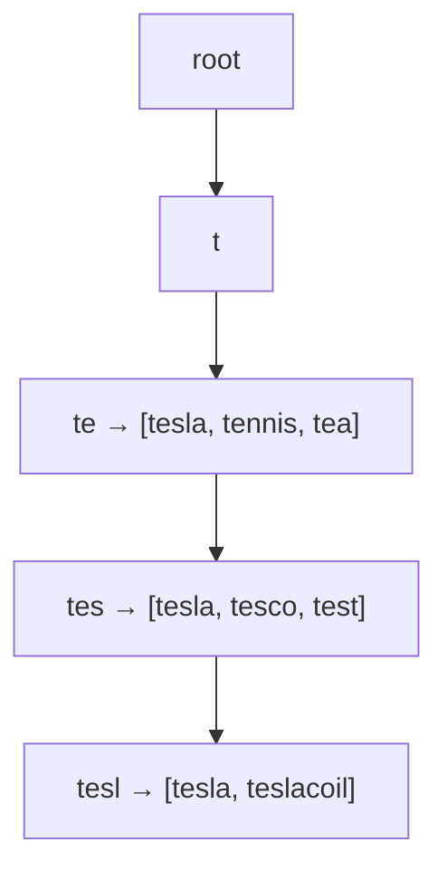

Typeahead fires a request on **every keystroke**, so it's extreme read-heavy and latency-critical (**< 100 ms**). The design splits cleanly into a **serving path** (fast) and a **build path** (offline).

## Step 1 — Requirements

- Return the **top ~5–10** completions for a prefix, ranked by **popularity**.
- **Fast** (p99 < 100 ms) and enormous QPS (a query per keystroke).
- Suggestions come from **historical search frequency**; refreshed periodically (near-real-time is a stretch goal, not required).

## Step 2 — The core structure: a trie with cached top-k

A plain **trie** finds all completions of a prefix, but walking the whole subtree per keystroke is too slow. The trick: **precompute and store the top-k completions at every node.** A lookup becomes "walk to the prefix node, return its cached list" — O(prefix length).



Each node stores its answer, so typing `t-e-s` just descends three edges and reads the list at `tes`.

## Step 3 — The two paths

```mermaid
flowchart LR
  subgraph Build["Build path (offline / batch)"]
    Logs[Query logs] --> Agg["Aggregate counts<br/>(weekly / hourly)"]
    Agg --> Build2["Build trie +<br/>top-k per node"]
  end
  Build2 --> Serve
  subgraph Serve["Serving path (online, in-memory)"]
    U[Keystroke] --> Serve["Trie shard<br/>(top-k lookup)"] --> Cache[(Edge/CDN cache)]
  end
```

- **Build path:** aggregate raw query logs into `(query, count)`, then build the trie with top-k baked into each node. Done **offline** on a schedule, then shipped to serving nodes — the write path never blocks reads.
- **Serving path:** the trie lives **in memory**; results are cached hard at the edge (the same prefixes are wildly popular).

## Step 4 — Scale and polish

:::senior
Two moves signal depth. **(1) Sharding:** partition the trie by prefix (e.g. by first 1–2 characters) across nodes so it fits in memory and spreads load; a router sends `te…` queries to the shard owning `t`. **(2) Freshness vs cost:** rebuilding the whole trie is expensive, so most systems refresh on a **cadence** (hourly/daily) and accept slight staleness — trending terms can be layered in via a smaller, frequently-updated overlay. Also mention **caching** aggressively: the top prefixes are requested constantly, so an edge/CDN cache absorbs most traffic.
:::

:::gotcha
Don't rank suggestions by a live query at request time — that blows the latency budget. Ranking is **precomputed** into the trie during the offline build. Sampling the logs (you don't need every event) keeps the aggregation affordable, and you still get the popular terms right.
:::

## Check yourself

```quiz
title: Autocomplete check
questions:
  - q: 'Why store the top-k completions AT each trie node instead of computing them on each request?'
    options:
      - text: 'A keystroke lookup becomes O(prefix length) — descend to the node and read its cached list — meeting the sub-100ms budget'
        correct: true
      - 'To save memory'
      - 'Because tries cannot be searched otherwise'
    explain: 'Precomputing top-k per node turns per-keystroke ranking into a simple descent + read, avoiding an expensive subtree scan or sort at request time.'
  - q: 'How is the ranking (by popularity) actually produced?'
    options:
      - text: 'Offline: aggregate query-log counts on a schedule and bake top-k into the trie, shipped to serving nodes'
        correct: true
      - 'By running a COUNT query on every keystroke'
      - 'Randomly'
    explain: 'The build path aggregates historical counts and precomputes rankings; the serving path only reads. This separation keeps reads fast and writes off the hot path.'
  - q: 'How do you keep the trie in memory at web scale?'
    options:
      - text: 'Shard it by prefix across nodes and route each query to the shard owning its prefix'
        correct: true
      - 'Store the whole trie on one giant server'
      - 'Rebuild it on every request'
    explain: 'Partitioning by leading characters spreads the structure and load across nodes while keeping each shard in memory; a router directs prefixes to the right shard.'
```

:::key
Autocomplete = a **trie with top-k precomputed at every node**, so a keystroke is an O(prefix) descent + cached read. Split into an **offline build path** (aggregate query-log counts → rebuild trie on a cadence) and an **in-memory serving path** (read-only, **sharded by prefix**, **edge-cached**). Precompute ranking; never rank live. Trade a little **staleness** for huge read speed.
:::
