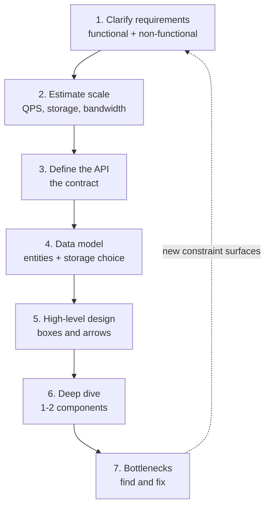

A system-design interview is **open-ended on purpose**. The interviewer is watching your
*process*, not hunting for one right answer. The failure mode is not "wrong architecture" —
it is **rambling with no structure and running out of time**. Fix that with one repeatable flow.

## The 7-step flow

Follow the same script every time. It signals seniority and guarantees you touch every axis
the interviewer scores you on.



Notice the dashed arrow: this is **not** a one-way waterfall. A bottleneck you find in step 7
often sends you back to renegotiate a requirement or re-estimate. Say that out loud — it shows
you think iteratively.

## The time budget (a 45-minute interview)

The single most common mistake is spending 20 minutes drawing boxes and never reaching a deep
dive. Budget your clock deliberately.

| Step | What you produce | Time | % |
|--|--|--|--|
| 1. Clarify requirements | A scoped feature list + SLAs | ~5 min | 11% |
| 2. Estimate scale | QPS, storage, bandwidth | ~5 min | 11% |
| 3. Define the API | 2-4 endpoint signatures | ~3 min | 7% |
| 4. Data model | Core entities + DB choice | ~4 min | 9% |
| 5. High-level design | The boxes-and-arrows diagram | ~8 min | 18% |
| 6. Deep dive | One component in depth | ~12 min | 27% |
| 7. Bottlenecks & wrap-up | Failure modes, scaling, trade-offs | ~8 min | 18% |

:::key
The **deep dive is where you earn a senior signal** — it is the biggest slice of the budget.
Steps 1-5 set up a shared vocabulary fast so you have *time* to go deep on something interesting.
:::

## Why each step exists

````tabs
tabs:
  - label: Steps 1-2 (Scope)
    body: |
      **Clarify + Estimate** stop you from designing the wrong system. Requirements decide
      *what* to build; estimation decides *how big* — and the numbers directly drive later
      choices (a cache, a shard count, a CDN).
      ```text
      "Is this read-heavy or write-heavy?" changes the entire architecture.
      ```
  - label: Steps 3-5 (Structure)
    body: |
      **API + Data model + High-level design** turn words into a concrete system you and the
      interviewer can point at. The API is the contract; the data model is the state; the
      diagram is the shared canvas for the rest of the conversation.
  - label: Steps 6-7 (Depth)
    body: |
      **Deep dive + Bottlenecks** are where senior candidates separate themselves. Pick the
      most interesting component (the one with real trade-offs) and go deep, then stress-test
      the whole design: what falls over first at 10x traffic?
````

:::tip
Announce the flow at the start: *"Let me clarify requirements, do a quick estimate, sketch the
API and data model, draw a high-level design, then deep-dive the trickiest part and look at
bottlenecks."* This buys you goodwill and a structure the interviewer can follow.
:::

:::gotcha
Do not treat the steps as rigid gates. If the interviewer says *"assume the requirements, get to
the design"*, skip ahead — reading the room beats following a checklist religiously.
:::

## Check yourself

```quiz
title: Framework check
questions:
  - q: 'Which step should get the largest share of a 45-minute interview?'
    options:
      - 'Clarifying requirements'
      - 'The high-level boxes-and-arrows diagram'
      - text: 'The deep dive on one or two components'
        correct: true
    explain: 'The deep dive (~12 min) is where you demonstrate depth and earn the senior signal. Earlier steps exist to set up the shared vocabulary quickly so you have time to go deep.'
  - q: 'What is the most common way candidates fail a system-design interview?'
    options:
      - 'Choosing SQL when NoSQL was expected'
      - text: 'No structure — rambling and running out of time'
        correct: true
      - 'Not memorizing exact latency numbers'
    explain: 'The interview scores your process. A structured flow with a time budget is the single biggest lever; the exact tech choices matter far less than a clear, organized approach.'
  - q: 'The dashed arrow from "Bottlenecks" back to "Requirements" represents:'
    options:
      - 'A mistake in the diagram'
      - text: 'Iteration — findings can send you back to renegotiate scope or re-estimate'
        correct: true
      - 'The end of the interview'
    explain: 'Good design is iterative. Discovering a bottleneck often means revisiting an assumption or a requirement — saying so out loud signals mature engineering judgment.'
```

:::key
Every SD interview = the same 7 steps: **clarify → estimate → API → data model → high-level
design → deep dive → bottlenecks**. Budget the clock, spend the most time on the deep dive, and
loop back when new constraints appear.
:::
