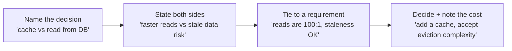

There is rarely a single correct architecture. The interviewer wants to hear you **weigh
options out loud**: name the choice, state both sides, tie the decision back to a requirement.
"It depends — and here is what it depends on" is the strongest sentence in the interview.

## The four classic trade-offs

### Consistency vs availability (CAP)

When the network partitions, you must choose: refuse the request (consistency) or serve possibly
stale data (availability). You cannot have both during a partition.

| Choose consistency (CP) when… | Choose availability (AP) when… |
|--|--|
| Money, inventory, bookings | Feeds, likes, view counts |
| A wrong answer is worse than no answer | A stale answer is fine for seconds |
| Banking, payments, seat reservation | Social timelines, analytics dashboards |

### The other three

| Trade-off | Lean one way when… | Lean the other when… |
|--|--|--|
| **Latency vs cost** | User-facing hot path → spend on cache/CDN/replicas | Background/batch → cheaper, slower storage is fine |
| **SQL vs NoSQL** | Relations, transactions, complex queries, ACID | Massive scale, flexible schema, simple key access |
| **Push vs pull** | Few writers, many readers → precompute (push) | Celebrity fan-out, cheap reads → compute on read (pull) |

````tabs
tabs:
  - label: SQL vs NoSQL
    body: |
      **SQL** gives you ACID transactions, joins, and a rigid schema — perfect when data is
      relational and correctness matters (payments, orders).
      ```text
      Need a multi-row transaction? -> SQL (Postgres, MySQL)
      ```
      **NoSQL** trades those for horizontal scale and schema flexibility — great for huge,
      simple, denormalized access patterns (a feed cache, a session store).
      ```text
      Need 400K key lookups/sec? -> NoSQL (Cassandra, DynamoDB)
      ```
  - label: Push vs pull (fan-out)
    body: |
      **Push (fan-out on write):** when a user posts, write the post into every follower's feed
      immediately. Reads are instant; writes are expensive.
      ```text
      Good: most users have few followers.
      Bad: a celebrity with 50M followers = 50M writes per post.
      ```
      **Pull (fan-out on read):** assemble the feed at read time by querying who they follow.
      Cheap writes, expensive reads. The real answer is **hybrid**: push for normal users, pull
      for celebrities.
````

## Say it out loud: the trade-off sentence

Use this template every time you make a choice:



:::senior
The mark of seniority is acknowledging the **downside of your own choice**. *"I'll add a cache —
but that introduces invalidation complexity and a consistency window I'll need to bound with a
TTL."* Naming your solution's weaknesses builds more trust than pretending it has none.
:::

## Common mistakes (and the fix)

| Mistake | Why it hurts | The fix |
|--|--|--|
| **Jumping straight to a solution** | Skips scope; you design the wrong thing | Clarify requirements first, always |
| **No estimation** | Choices float free of any numbers | Do the QPS/storage math up front |
| **Ignoring bottlenecks** | Design looks naive at scale | Stress-test at 10x; find the first thing that breaks |
| **One-sided answers** | "Just use Cassandra" signals shallow thinking | Name the alternative and why you rejected it |
| **Silent thinking** | Interviewer can't follow or help you | Narrate. Think out loud, use the whiteboard |
| **Over-engineering** | Multi-region for a 100-user app | Match complexity to the stated scale |

:::gotcha
The most common failure is **jumping to a solution** — blurting "I'd use Kafka and Cassandra"
before anyone has agreed on what the system does. Requirements first, numbers second, tech last.
:::

## Check yourself

```quiz
title: Trade-offs check
questions:
  - q: 'A payment system must never double-charge. During a network partition you should favor:'
    options:
      - text: 'Consistency — refuse the request rather than risk a wrong charge'
        correct: true
      - 'Availability — always accept the payment'
      - 'Neither; CAP does not apply to payments'
    explain: 'For money, a wrong answer is worse than no answer. Choose CP: reject or delay during a partition rather than risk an incorrect balance.'
  - q: 'A celebrity with 50M followers posts. Pure push (fan-out on write) is problematic because:'
    options:
      - 'Reads become too slow'
      - text: 'One post triggers 50M feed writes — a huge, spiky write amplification'
        correct: true
      - 'It violates the CAP theorem'
    explain: 'Push precomputes each follower feed on write, so a celebrity post fans out to millions of writes. The usual fix is hybrid: push for normal users, pull for celebrities.'
  - q: 'Which is the single most common candidate mistake?'
    options:
      - 'Using the wrong hashing algorithm'
      - text: 'Jumping straight to a solution before clarifying requirements'
        correct: true
      - 'Forgetting exact latency numbers'
    explain: 'Proposing tech before agreeing on what to build means you may design the wrong system entirely. Clarify requirements and estimate scale before choosing components.'
```

:::key
Trade-offs have no single right answer — **name the decision, state both sides, tie it to a
requirement, and admit the downside**. Know CAP, latency-vs-cost, SQL-vs-NoSQL, and push-vs-pull
cold. Avoid the classics: jumping to a solution, skipping estimation, and ignoring bottlenecks.
:::
